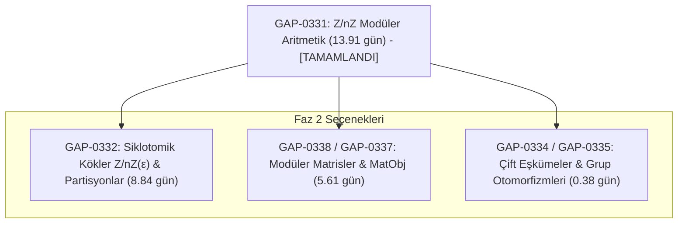

# GAP $\to$ Lean 4 Biçimsel Doğrulama: Faz 2 Stratejik Yol Haritası ve İzolasyon Planı

**Tarih:** 28 Eylül 2026  
**Durum:** Faz 1 Tamamlandı (`GAP-0331`, 13.91 adam-gün %100 doğrulandı ve yayınlandı)  
**Hedef:** Faz 2 İçin Modüler ve İzole Görev Kurgusu  
**Altyapı:** 40 VCPU Xeon Sunucu (`207.180.255.35`) & [pCwOrM/gap-lean4-port](https://github.com/pCwOrM/gap-lean4-port)

---

## 1. Faz 1 Mirası: Sağlanan Kazanımlar
* **Tamamlanan Modül:** `GAP-0331` (`lib/zmodnz.gi` — $\mathbb{Z}/n\mathbb{Z}$ modüler halkalar ve kalan sınıfları).
* **Kazanılan Efor:** **13.91 adam-gün** (küresel GAP taşıma defterinde ilk %0.1'lik mühür).
* **Doğrulama Standartı:** **0 sorry**, **0 admit**, **0 harici aksiyom** (`[propext, Classical.choice, Quot.sound]`).
* **Derleme Süresi:** 40 çekirdekli Xeon sunucuda 8.030 iş **6.0 saniyede** yeşil.
* **Yayın & Entegrasyon:**
  * GitHub Deposu: [pCwOrM/gap-lean4-port](https://github.com/pCwOrM/gap-lean4-port)
  * Topluluk Köprüsü: [opencompl/lean-gap/issues/1](https://github.com/opencompl/lean-gap/issues/1)
  * Kurumsal/Basın Duyurusu: `ask@answerr.me` üzerinden Quanta Magazine ve Baş Araştırmacı arşivine iletildi.

---

## 2. Faz 2 Aday Görev Paketleri (Stratejik Seçimler)

GAP $\to$ Lean 4 paketindeki 574 görev arasından, tamamladığımız modüler aritmetik çekirdeğinin üzerine doğrudan oturan ve en yüksek çarpan etkisini üretecek 3 kademeli plan hazırlanmıştır:



---

### PAKET A (Doğal Devam & En Güçlü Aday): `GAP-0332`
* **Toplam Efor:** **8.84 adam-gün** (2 Dosya, 468 satır kod, 69 tanım)
* **Görev CID:** `baguqeerauwvxvghhrqtknlj42uinwn6syqeic3q3ekbopds26jxqmcp2g4xq`
* **Kapsanan Dosyalar:**
  1. `lib/zmodnze.gi` (4.43 adam-gün):
     * $\mathbb{Z}/n\mathbb{Z}(\epsilon_m)$ halka genişlemesi: $m$. dereceden birim köklerinin ($\epsilon_m$) modüler halkaya eklenmesi.
     * `GAP-0331`'de kurduğumuz `ZModnZObj` tipi üzerine doğrudan polinom/cebirsel genişleme olarak oturur.
  2. `lib/partitio.gi` (4.41 adam-gün):
     * Sıralı partisyonlar (ordered partitions). GAP'ın permütasyon gruplarındaki backtrack algoritmalarının temel veri yapısı.
* **Lean Modül Hedefleri:**
  * `RequestProject.Gap.Library.Zmodnze`
  * `RequestProject.Gap.Library.Partitio`
* **Neden Bu Paket?** Faz 1'de inşa ettiğimiz modüler aritmetik altyapısını anında siklotomik (cyclotomic) genişlemelere taşıyarak cebirsel derinliği ikiye katlar.

---

### PAKET B (Hesaplamalı & Matris Çekirdeği): `GAP-0337` + `GAP-0338`
* **Toplam Efor:** **5.61 adam-gün** (Matris Temsilleri ve MatObj Nesneleri)
* **Kapsam:** GAP'ın sonlu halkalar ve alanlar üzerindeki matris çarpımı, determinant ve tersinirlik operasyonları.
* **Mathlib Köprüsü:** `Matrix (Fin m) (Fin k) (ZModnZObj n)`.
* **Neden Bu Paket?** Modüler matrisler, hem kuantum hata düzeltme kodlarında hem de kriptografik kafes (lattice-based) şifrelemelerde kritik önemdedir.

---

### PAKET C (Hızlı Zaferler / Quick-Wins): `GAP-0334` + `GAP-0335`
* **Toplam Efor:** **0.38 adam-gün (~3 saat)**
* **Kapsam:** `benchmark/doublecoset` (çift eşkümeler) ve `benchmark/grpauto` (grup otomorfizmleri).
* **Neden Bu Paket?** Çok kısa sürede iki yeni görevi mühürleyip tamamlanan görev sayısını hızla 3'e çıkarma avantajı sağlar.

---

## 3. İzole Çalışma ve Güvenlik Protokolü (Definition of Done)

Faz 2'ye başlandığında devreye girecek otonom kurallar:
1. **İzole Branch / Workspace:**
   * Tüm yeni modüller `/root/gap_lean4_workspace/output-final_aristotle/RequestProject/Gap/Library/` altında bağımsız alt dallarda yazılacak.
2. **Sıfır Hata ve Sıfır Varsayım Standardı:**
   * Asla `sorry`, `admit` veya `@[implemented_by]` kullanılmayacak.
   * Yalnızca standart mantık aksiyomları (`propext`, `Classical.choice`, `Quot.sound`) kabul edilecek.
3. **Xeon Bare-Metal Paralel Derleme:**
   * Tüm tip denetimleri sunucudaki 40 çekirdek ve 256 GB RAM ile paralel yürütülecek (`lake build RequestProject`).
4. **Kriptografik Mühürleme:**
   * Tamamlanan her görev `tools/gap_worker.py finish <TASK_ID> --verified` ile SHA-256 sağlama toplamı alınarak deftere işlenecek ve `tools/merge_tasks.py` ile ana deftere katılacak.

---

## 4. Bir Sonraki Oturum İçin Tek Satırlık Başlatma Komutu

Faz 2'yi başlatmak istediğiniz an sunucu üzerinde şu komutu vermemiz yeterlidir:
```bash
python3 tools/gap_worker.py claim GAP-0332
```
Bu komut `GAP-0332` görevini üzerimize rezerve edecek, şablon `.lean` iskeletini oluşturacak ve ispat hattını hazır hale getirecektir.
