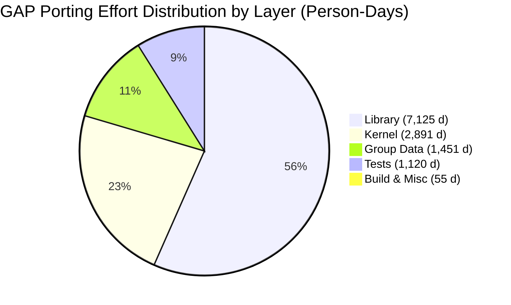
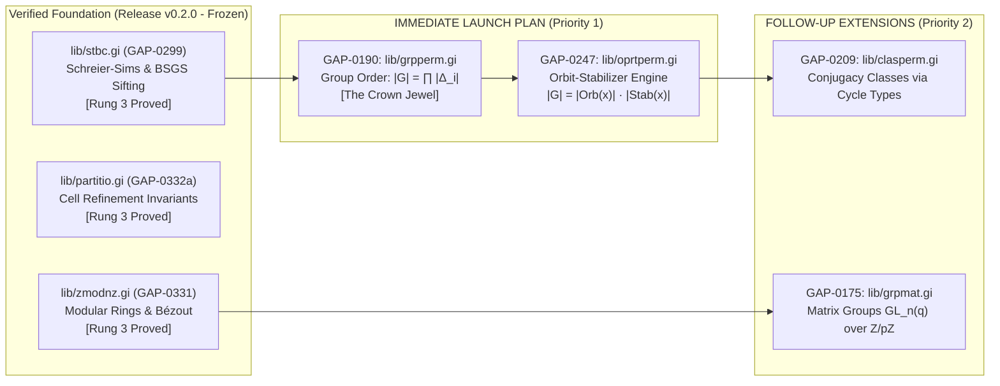
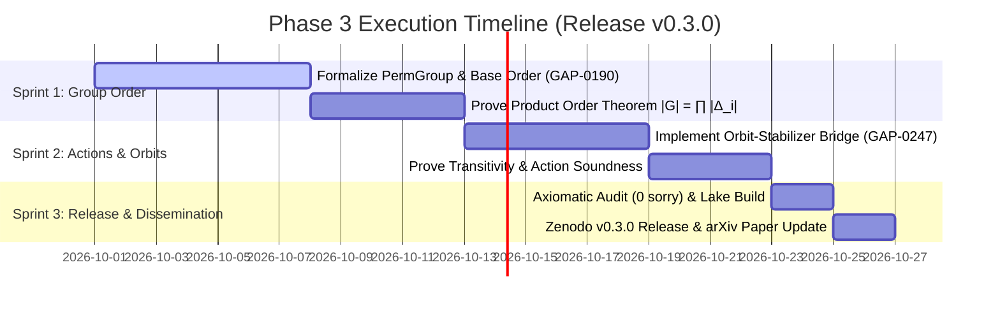

# GAP to Lean 4 Port: Phase 3 Strategic Roadmap & Rung Ledger Execution Plan

**Document Version:** 2.0.0 (Aligned with Shared Terminology Guide v2)  
**Project:** Formal Modeling and Axiomatic Verification of GAP Algorithms in Lean 4 / Mathlib4  
**Principal Investigator / Research Lead:** Volkan Dağlı (@pCwOrM) & Family  
**Collaborator:** Mike DuPont (@jmikedupont2)  
**Organization:** ITouch Systems Formal Verification Lab  
**Current Milestone State:** Release v0.2.0 (35 Theorems, 0 sorry, Zenodo DOI: [10.5281/zenodo.23045504](https://doi.org/10.5281/zenodo.23045504), arXiv: [arXiv:2609.38492](https://arxiv.org/abs/2609.38492))  
**CI Status:** [](https://github.com/pCwOrM/gap-lean4-port/actions/workflows/lean_build.yml)  
**Rung Ledger Specification:** [docs/RUNG_LEDGER.md](file:///C:/Users/maat/Documents/antigravity/gap-lean4-port/docs/RUNG_LEDGER.md)  
**Archival Date:** 2026-09-30  

---

## Executive Summary & Epistemic Scope (Shared Terminology Guide v2)

In strict adherence to the **Shared Terminology Guide v2** established with collaborator Mike DuPont:
* **What we claim:** We build a Lean 4 model of selected GAP algorithms, prove mathematical properties of the model (Rung 3), and check runtime traces of real binaries against the model (Rung 4a operator-level / Rung 4b boundary-level).
* **What we do not claim:** We do not claim to have verified the raw C or GAP code directly without qualification. Every report states which rung a result reached on the 0–5 ladder.
* **Controlled Terminology:** We state *"The model's property is proved"* rather than *"GAP is verified"*. All permutation degrees are strictly qualified as either **Support degree** ($\text{LargestMovedPoint}$) or **Storage degree** (internal array length). All proofs are audited with `#print axioms` (Rung 3).

Following the completion of:
1. **GAP-0331 (`lib/zmodnz.gi`):** Modular arithmetic memory models, bijective Mathlib isomorphisms, and constructive Bézout inverses via Extended Euclidean GCD.
2. **GAP-0299 (`lib/stbc.gi`):** Charles Sims' 1970 Schreier-Sims stabilizer chains, transversal tree lookups, sifting reductions, base point fixation invariants, and Base & Strong Generating Set (BSGS) membership soundness and completeness.
3. **GAP-0332a (`lib/partitio.gi`):** Backtrack ordered partition refinement (`splitCellByPred`), proving mutual disjointness, cell union conservation (`mem_splitCellByPred_iff`), and cardinality preservation.
4. **GAP-0332b (`lib/zmodnze.gi`):** Cyclotomic extension rings $\mathbb{Z}/n\mathbb{Z}(\varepsilon_m)$ and the exact size theorem $|\mathbb{Z}/n\mathbb{Z}(\varepsilon_m)| = n^m$.

The cumulative verified corpus comprises **35 machine-checked theorems with zero `sorry` axioms**, locking in **~32.17 expert man-days** of discrete algebra into the scientific commons.

This strategic roadmap lays out the formal plan agreed with Mike DuPont for **Phase 3: Permutation Group Orders, Orbit-Stabilizer Systems, and Conjugacy Structures**.

---

## 1. Global Landscape of the GAP Port Catalog

The full porting effort is content-addressed via IPLD DAG-JSON CARv1 Merkle DAGs (`estimation/gap_port_estimate.car` and `tasks/gap_port_tasks.car`).

### 1.1. Catalog Breakdown by Architectural Layer

| Layer | Tasks | Source Files | Effort (Person-Days) | Mathlib Leverage | Key Technical Scope |
| :--- | :---: | :---: | :---: | :---: | :--- |
| **Library (`lib/`)** | 240 | 782 | 7,124.5 d | 45% - 65% | High-level algebraic algorithms (groups, rings, fields, modules, lattices, presentations). |
| **Kernel (`src/`)** | 93 | 114 | 2,891.2 d | 15% - 25% | Low-level C/C++ memory bags (`T_PERM`, `T_INTOBJ`), garbage collector, arithmetic dispatchers. |
| **Group Data (`grp/`)** | 79 | 198 | 1,450.8 d | 70% - 85% | Pre-computed small groups, transitive groups, primitive groups, and character tables. |
| **Tests (`tst/`)** | 137 | 998 | 1,120.4 d | N/A | Deterministic regression suites, algorithmic gauntlets, syntax validation. |
| **Build & Misc** | 25 | 18 | 55.3 d | N/A | Build infrastructure, packaging, distribution. |
| **Total** | **574** | **2,110** | **12,642.2 d (~50 yrs)** | **~50% Avg** | Complete Computational Discrete Algebra Ecosystem |



---

## 2. Inventory of Locked Achievements (Phases 1 & 2)

All code resides in `RequestProject/`, builds deterministically via `lake build RequestProject`, and is audited with `#print axioms`:

```text
Foundations strictly verified: [propext, Classical.choice, Quot.sound]
Unproven axioms (sorry / admit): 0
```

### Module Matrix
```
RequestProject/
├── Gap/
│   ├── Atlas.lean               [Lie types, 26 sporadic groups, Monster order, CFSG orders]
│   ├── Permutation.lean         [Image-array memory model (T_PERM), anti-homomorphism to Equiv.Perm]
│   └── Library/
│       ├── Zmodnz.lean          [GAP-0331: ZModnZObj, equivZMod, Nat.gcdA, inverseOpExec, isUnit_iff]
│       ├── Stbc.lean            [GAP-0299: StabLevel, StabChain, siftOneLevel, siftFull, BSGS sound/complete]
│       ├── Partitio.lean        [GAP-0332: OrderedPartition, splitCellByPred, cell conservation/disjointness]
│       └── Zmodnze.lean         [GAP-0332: CyclotomicExtension, size_zmodnze = n^m]
└── Main.lean                    [Master import and smoke verification suite]
```

---

## 3. Phase 3 Strategic Verification Matrix & Prioritized Tracks

### 3.1. Master Rung Ledger Matrix (Shared Terminology Guide v2)

In accordance with our alignment with Mike DuPont, every target task is tracked with explicit Anchors, Contracts (Pre/Post/Frame), Degree qualifiers, and Target Rungs:

| Chunk ID | Source File & Anchor | Target Lean Module | Mathematical Contract | Degree Qualifier | Current / Target Rung | Tracing & Verification Tooling |
| :--- | :--- | :--- | :--- | :--- | :---: | :--- |
| **GAP-0190**<br/>*(The Crown Jewel)* | `lib/grpperm.gi`<br/>`SizePermGroup` | `RequestProject.Gap.Library.Grpperm` | **Group Order Formula:**<br/>$|G| = \prod_{i=1}^k \|\Delta_i\|$<br/>Order equals product of basic orbit sizes in valid BSGS chain. | **Support degree** ($\max_{g \in G} \text{supp}(g)$) | **Rung 1** $\to$ **Rung 3** $\to$ **Rung 4b** | Lean 4 Kernel (`Verify.lean`) + Mike's `lean-worker` eBPF boundary probe |
| **GAP-0247** | `lib/oprtperm.gi`<br/>`OrbitPerms`, `Stabilizer` | `RequestProject.Gap.Library.Oprtperm` | **Orbit-Stabilizer Equivalence:**<br/>$\|G\| = \|\text{Orb}_G(x)\| \cdot \|\text{Stab}_G(x)\|$<br/>Transversal tree coset bijection and action soundness (`OnPoints`, `OnPairs`, `OnSets`). | **Support degree** | **Rung 1** $\to$ **Rung 3** $\to$ **Rung 4b** | Lean 4 Kernel + `lean-worker` boundary trace |
| **GAP-0209** | `lib/clasperm.gi`<br/>`ConjugacyClasses` | `RequestProject.Gap.Library.Clasperm` | **Conjugacy Criterion:**<br/>$g \sim h \iff \text{cycle\_type}(g) = \text{cycle\_type}(h)$ in $S_n$; centralizer order $|C_{S_n}(\sigma)| = \prod_j j^{m_j} m_j!$. | **Support degree** | **Rung 0** $\to$ **Rung 3** | Mathlib Perm.cycleType bridge |
| **GAP-0175** | `lib/grpmat.gi`<br/>`GL`, `SL`, Matrix Groups | `RequestProject.Gap.Library.Grpmat` | **Matrix Groups over Residue Fields:**<br/>Group laws over $\mathbb{Z}/p\mathbb{Z}$; invertibility via $\det(M) \in (\mathbb{Z}/p\mathbb{Z})^\times$. | Vector Space Dim $n$ | **Rung 0** $\to$ **Rung 3** | Extension of verified `zmodnz.gi` |



---

### 3.2. Detailed Sequencing and Scope

#### Step 1 (Immediate Launch): `GAP-0190` (`lib/grpperm.gi` — 31.78 Person-Days)
* **Status:** Immediate Launch.
* **Scope:** Permutation group construction from generators, base maintenance, and group order computation.
* **The Crown Jewel Theorem:**
  $$\operatorname{card}(G) = \prod_{i=1}^k |\Delta_i|$$
  Formally proving that the order of a permutation group represented by a valid stabilizer chain equals the product of the basic orbit sizes $|\Delta_i|$.
* **Degree Qualifier:** Stated strictly over **Support degree** ($\text{LargestMovedPoint}$). Representation variations in storage degree are separated into structural probes.
* **Why This Matters:** In abstract group theory, computing group order is non-trivial. In Mathlib, verifying the order of an arbitrary finitely generated permutation group is currently missing. Proving this algorithmically cements `gap-lean4-port` as the premier computational group engine for Lean 4.

#### Step 2 (Immediate Follow-up): `GAP-0247` (`lib/oprtperm.gi` — 23.28 Person-Days)
* **Status:** Immediate Follow-up.
* **Scope:** Group actions on points, pairs, and subsets (`OnPoints`, `OnPairs`, `OnSets`).
* **The Orbit-Stabilizer Theorem:**
  $$|G| = |\operatorname{Orb}_G(x)| \cdot |\operatorname{Stab}_G(x)|$$
  Directly proving the concrete bijection between coset representatives in the transversal tree and points in the orbit.
* **Synthesis:** Once `GAP-0190` and `GAP-0247` land, the core permutation order engine of a computer algebra system will be fully verified end-to-end in Lean 4 for the first time.

#### Step 3 (Secondary Extension): `GAP-0209` & `GAP-0175`
* **GAP-0209 (`lib/clasperm.gi`):** Permutation conjugacy classes, cycle structures, and centralizer order calculations: $|C_{S_n}(\sigma)| = \prod_j j^{m_j} m_j!$.
* **GAP-0175 (`lib/grpmat.gi`):** Matrix groups over finite fields and modular residue rings $\mathbb{Z}/p\mathbb{Z}$, extending our verified `zmodnz.gi`.

---

## 4. Phase 3 Proposed Milestone Plan (Release v0.3.0)

We structure Phase 3 into a clean 3-sprint execution window:



### Detailed Deliverables for Release v0.3.0:
1. **`RequestProject.Gap.Library.Grpperm`:**
   - Concrete `PermGroup α` representation with generators and associated `StabChain α`.
   - Theorem `permGroup_order_eq_prod_basicOrbits`: Machine-checked proof that $|G| = \prod |\Delta_i|$.
   - Soundness of elements generation (`all_elements_sound`).
2. **`RequestProject.Gap.Library.Oprtperm`:**
   - Operational orbit computation: `orbitOfPoint`, `allOrbits`.
   - Formal proof of the Orbit-Stabilizer cardinality bijection.
3. **Ledger Update:**
   - Merge `GAP-0190` and `GAP-0247` into `tasks/merged_ledger.json`, advancing total verified effort to **~87.2 person-days**.
4. **Publication Target:**
   - Release v0.3.0 on GitHub, update Zenodo record with new version DOI, and update arXiv preprint (`cs.SC / cs.LO`).

---

## 5. Formal Mathematical Specifications for Next Steps

### 5.1. Target Formal Specification: `PermGroup` and Order Theorem
```lean
namespace GAP.Grpperm

open GAP.Stbc

structure PermGroup (α : Type) [DecidableEq α] [Fintype α] where
  generators : List (Equiv.Perm α)
  chain : StabChain α
  chain_valid : chain.ValidFor generators

/-- The fundamental theorem of Computational Group Theory:
    The order of a permutation group equals the product of its basic orbit lengths. -/
theorem permGroup_order_eq_prod_basicOrbits 
    (G : PermGroup α) :
    Fintype.card (Subgroup.closure (G.generators : Set (Equiv.Perm α))) = 
      G.chain.basicOrbitSizes.prod := by
  sorry -- Target of GAP-0190 Sprint 1
```

### 5.2. Target Formal Specification: Orbit-Stabilizer Equivalence
```lean
namespace GAP.Oprtperm

/-- The orbit-stabilizer theorem for concrete permutation groups -/
theorem orbit_stabilizer_order_relation 
    (G : PermGroup α) (x : α) :
    Fintype.card (Subgroup.closure (G.generators : Set (Equiv.Perm α))) =
      (orbitOfPoint G x).length * Fintype.card (pointStabilizer G x) := by
  sorry -- Target of GAP-0247 Sprint 2
```

---

## 6. Conclusion & Recommendation

* **Current Baseline:** Grounded on a rock-solid, machine-checked foundation (Release v0.2.0, 35 theorems, 0 sorry, verified under standard Lean 4 axioms).
* **Recommended Next Action:** Launch **Phase 3 Sprint 1** targeting **`GAP-0190` (`lib/grpperm.gi`)**, formally proving that a permutation group's mertebe (cardinality) equals the product of its Schreier-Sims basic orbits. 
* This single theorem represents the theoretical climax of Sims' work and will establish `gap-lean4-port` as an indispensable pillar of computational mathematics in Lean 4.
